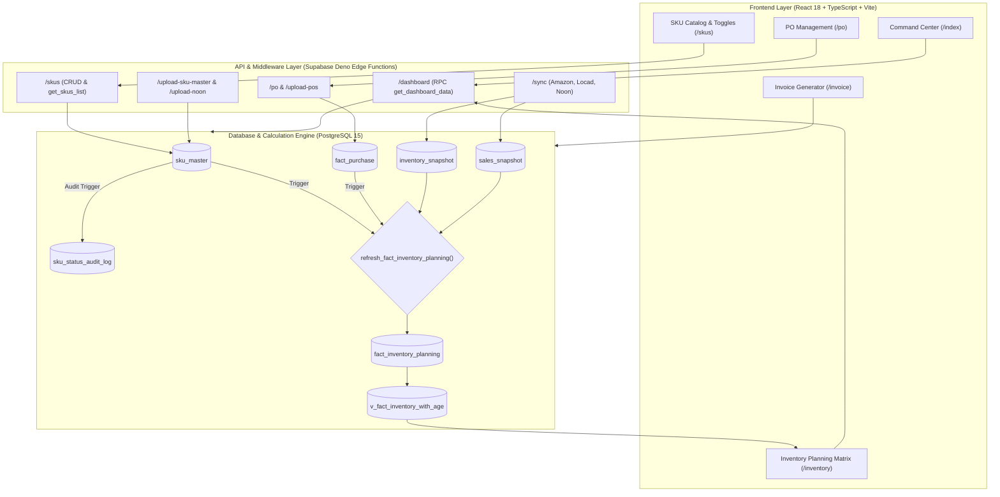

# Comprehensive Application Architecture & System Logic Deep Dive

---

## Table of Contents
1. [Executive Overview & High-Level Architecture](#1-executive-overview--high-level-architecture)
2. [Deep Module Breakdown](#2-deep-module-breakdown)
3. [End-to-End Data Pipeline & Transformation Flow](#3-end-to-end-data-pipeline--transformation-flow)
4. [Database Deep Analysis & Schema Catalog](#4-database-deep-analysis--schema-catalog)
5. [Core Business Rules & Algorithmic Models](#5-core-business-rules--algorithmic-models)
6. [Real-World Mathematical Walkthrough](#6-real-world-mathematical-walkthrough)
7. [File Upload Subsystem & Ingestion Specifications](#7-file-upload-subsystem--ingestion-specifications)
8. [Active / Inactive Status Logic & Audit Trail Architecture](#8-active--inactive-status-logic--audit-trail-architecture)
9. [Comprehensive API Catalog](#9-comprehensive-api-catalog)
10. [Authentication, Authorization & Security Architecture](#10-authentication-authorization--security-architecture)
11. [Dashboard & Analytical KPI Lineage](#11-dashboard--analytical-kpi-lineage)
12. [Multi-Marketplace, Multi-Country & Tenant Isolation Logic](#12-multi-marketplace-multi-country--tenant-isolation-logic)
13. [Concurrency, Transactions & Race Condition Analysis](#13-concurrency-transactions--race-condition-analysis)
14. [Performance Engineering & Bottleneck Analysis](#14-performance-engineering--bottleneck-analysis)
15. [Codebase Vulnerabilities, Edge Cases & Bug Catalog](#15-codebase-vulnerabilities-edge-cases--bug-catalog)
16. [Business User & Executive Guide](#16-business-user--executive-guide)
17. [End-to-End Single SKU Lifecycle Simulation](#17-end-to-end-single-sku-lifecycle-simulation)
18. [System Architecture Diagram](#18-system-architecture-diagram)
19. [Prioritized Engineering Roadmap ("What to Fix First")](#19-prioritized-engineering-roadmap-what-to-fix-first)

---

## 1. Executive Overview & High-Level Architecture

The system is an **Enterprise Multi-Channel E-Commerce Inventory Planning, Replenishment, and Fulfillment Orchestration Platform** tailored for consumer brands operating across **Amazon FBA**, **Noon FBN**, **Noon Quick-Commerce (Minutes)**, and **Locad Central 3PL Warehousing** in the **United Arab Emirates (UAE)** and **Kingdom of Saudi Arabia (KSA)**.

```text
                                  USER INTERFACE (Browser)
                                             │
      ┌──────────────────────────────────────┼──────────────────────────────────────┐
      ▼                                      ▼                                      ▼
[Command Center]                       [Inventory Matrix]                     [SKU / PO Hub]
(Dashboard, KPIs, Alerts)           (Coverage, Reorder, Allocation)         (Catalogs, Creation, Uploads)
      │                                      │                                      │
      └──────────────────────────────────────┼──────────────────────────────────────┘
                                             │ HTTPS / JWT Auth / LocalStorage Context
                                             ▼
                                  API & MIDDLEWARE LAYER
                     (Supabase Edge Functions / Deno Runtime & Vite Proxy)
      ┌──────────────────────────────────────┼──────────────────────────────────────┐
      ▼                                      ▼                                      ▼
[/dashboard, /skus, /po]             [/sync, /upload-*]                     [/planning, /analytics]
Data Retrieval & Aggregation        Ingestion, Parsing & ETL               Planning Views & Matrices
      │                                      │                                      │
      └──────────────────────────────────────┼──────────────────────────────────────┘
                                             │ PostgreSQL RPCs / Triggers / Views
                                             ▼
                               DATABASE & BUSINESS LOGIC ENGINE
                                   (Supabase PostgreSQL 15)
 ┌───────────────────────────────────────────────────────────────────────────────────────────────┐
 │ • Table Entities: sku_master, fact_purchase, inventory_snapshot, sales_snapshot, invoices      │
 │ • Analytical Rollups: fact_inventory_planning, demand_metrics, v_fact_inventory_with_age      │
 │ • Core Procedures: refresh_fact_inventory_planning(), get_dashboard_data(), get_skus_list()   │
 │ • Automated Triggers: trg_auto_activate_sku, trigger_refresh_fact_inventory_planning          │
 └───────────────────────────────────────────────────────────────────────────────────────────────┘
                                             │
                                             ▼
                               REPORTS, DECISIONS & OUTPUTS
      ┌──────────────────────────────────────┼──────────────────────────────────────┐
      ▼                                      ▼                                      ▼
[Ship Now (Locad → FBA/FBN)]           [PO Reorder Generation]               [Commercial Invoices]
Optimized Box Allocation Plans         Shortfall & Lead Time Ordering         Multi-page PDF Generation
```

### Layer Breakdown
1. **Frontend Presentation Layer**: Built with **React 18**, **TypeScript**, **Tailwind CSS**, and **Lucide React**. Routes are managed through a custom URL/hash router (`router.ts`). State management utilizes specialized hooks (`useOperationsHub`, `useSKUData`, `usePOData`, `useInvoiceData`) backed by an in-memory client-side cache and request deduplicator (`api.ts`).
2. **Context & Tenant Scoping**: Cross-cutting country and account selection is handled via `RegionContext.tsx` and persisted in `localStorage` (`selected_country` and `selected_account`).
3. **API & Edge Compute Layer**: Comprises 18 specialized **Deno Edge Functions** running on the Supabase Functions runtime (`upload-sku-master`, `upload-pos`, `upload-noon`, `upload-noon-inventory`, `upload-noon-minutes`, `sync`, `skus`, `po`, `dashboard`, `planning`, `analytics`, `subcategory-revenue`).
4. **ETL & Parsing Engines**: Edge function parsers utilizing `XLSX` (SheetJS) and streaming CSV engines normalize external marketplace reports.
5. **Database Business Engine**: Complex replenishment models, sales velocity rollups (7d, 30d, 60d), stockout risks, safety buffer calculations, and multi-channel box allocations are implemented natively in **PostgreSQL PL/pgSQL stored procedures** (`refresh_fact_inventory_planning.sql`, `084_get_dashboard_data_rpc.sql`).

---

## 2. Deep Module Breakdown

---

### MODULE 1: SKU Master Catalog & Channel Management

* **Purpose**: Serves as the authoritative master repository for all product identifiers, dimensions, carton configurations (`units_per_box`), factory MOQs, baseline COGS, lead times, and channel-level selling flags (`amazon_active`, `noon_active`, `minutes_active`).
* **Triggering Actions**:
  - Direct UI creation/editing via `SKUsNew` modal (`skus_new.tsx`).
  - Bulk catalog upload via `/upload-sku-master`.
  - Channel toggle switches (Active/Inactive) directly in the table view.
* **Frontend Flow**:
  1. `skus_new.tsx` loads data via `api.getSKUs()` invoking RPC `get_skus_list`.
  2. Toggling a switch fires `api.updateSKU(sku, { [channel_field]: boolean })`.
  3. Caches for `/skus`, `/dashboard`, and `/planning` are invalidated.
* **Backend Flow (`supabase/functions/skus/index.ts`)**:
  1. Validates body against allowed fields: `['name', 'asin', 'fnsku', 'category', 'product_category', 'sub_category', 'moq', 'lead_time_days', 'cogs', 'units_per_box', 'dimensions', 'weight_kg', 'cbm', 'is_active', 'amazon_active', 'noon_active', 'minutes_active']`.
  2. Executes `UPDATE sku_master SET ... WHERE sku = $1 AND country = $2`.
  3. Calls `supabase.rpc('refresh_fact_inventory_planning')` to trigger immediate recalculation of all replenishment and allocation numbers.
* **Database Tables & Fields Affected**:
  - Table: `sku_master`
  - Fields: `is_active`, `amazon_active`, `noon_active`, `minutes_active`, `units_per_box`, `moq`, `cogs`, `lead_time_days`.

---

### MODULE 2: Purchase Order (PO) Register & Inbound Tracking

* **Purpose**: Tracks procurement lifecycles from supplier order issuance to final warehouse receipt. Accurately calculates inbound stock quantities (`already_ordered`) to deduct from suggested factory reorders.
* **Triggering Actions**:
  - Creating a PO manually via `CreatePOModal` in `po_new.tsx`.
  - Ingesting bulk PO spreadsheets via `/upload-pos`.
  - Status updates (`Draft` $\rightarrow$ `Ordered` $\rightarrow$ `Shipped` $\rightarrow$ `In_Transit` $\rightarrow$ `Delivered` $\rightarrow$ `Closed` $\rightarrow$ `Cancelled`).
* **Backend Flow (`supabase/functions/po/index.ts`)**:
  - Enforces valid state transitions via `VALID_PO_TRANSITIONS` (`types.ts`).
  - Flattens multi-line PO JSON into normalized relational records in `fact_purchase`.
  - Aggregates pending inbound inventory:
    $$\text{already\_ordered} = \sum (\text{units\_ordered} - \text{units\_received}) \quad \forall \text{ POs with status } \in \{\text{'ordered'}, \text{'shipped'}, \text{'in\_transit'}\}$$
* **Database Operations**:
  - `INSERT / UPDATE fact_purchase`.
  - Re-executes `refresh_fact_inventory_planning()`.

---

### MODULE 3: Multi-Channel Sales Ingestion & Velocity Engine

* **Purpose**: Ingests historical unit sales per marketplace to calculate moving sales velocities.
* **Ingestion Channels**:
  1. **Amazon**: Automated daily sync from Saddl PostgreSQL raw tables (`sc_raw.sales_traffic`) via `/sync/amazon`.
  2. **Noon FBN**: Daily CSV sales exports uploaded via `/upload-noon`.
  3. **Noon Minutes**: Quick-commerce daily exports uploaded via `/upload-noon-minutes`.
* **Database Processing**:
  - Inserts daily records into `sales_snapshot (sku, date, channel, units_sold, country, saddl_id)`.
  - Computes rolling 30-day moving averages:
    $$\text{amazon\_sv} = \frac{\sum_{t=-30}^0 \text{units\_sold}_{\text{amazon}}}{30.0}$$
    $$\text{noon\_sv} = \frac{\sum_{t=-30}^0 \text{units\_sold}_{\text{noon}}}{30.0}$$
    $$\text{minutes\_sv} = \frac{\sum_{t=-30}^0 \text{units\_sold}_{\text{noon\_minutes}}}{30.0}$$
    $$\text{blended\_sv} = \text{amazon\_sv} + \text{noon\_sv} + \text{minutes\_sv}$$

---

### MODULE 4: Warehouse Inventory Snapshot & Stock Consolidation

* **Purpose**: Records daily snapshot balance levels across all physical fulfillment centers.
* **Fulfillment Nodes**:
  - `amazon_fba`: FBA Available Units.
  - `noon_fbn`: Noon Warehouse Available Units.
  - `Minutes`: Noon 15-minute fulfillment dark store units.
  - `locad_warehouse`: Central 3PL storage in Locad (measured in **Boxes** and **Units**).
* **Consolidation Formula**:
  - Filters for the latest snapshot date per node using SQL window functions (`ROW_NUMBER() OVER (PARTITION BY sku, node, warehouse_name ORDER BY snapshot_date DESC)`).
  - Unifies available stock:
    $$\text{stock\_in\_hand} = \text{fba\_units} + \text{fbn\_units} + \text{minutes\_units} + (\text{locad\_boxes} \times \text{units\_per\_box})$$

---

### MODULE 5: Central Planning Engine & Replenishment Model

* **Purpose**: Executes the core automated inventory intelligence: ABC inventory classification, stockout risk flags, suggested supplier reorder quantities, and inter-channel box allocation.
* **Execution Location**: PostgreSQL Procedure `refresh_fact_inventory_planning()`.
* **Replenishment Target**:
  - **Class A SKUs** (Top 80% volume): **60 Days** of stock coverage required.
  - **Class B SKUs** (Next 15% volume): **45 Days** of stock coverage required.
  - **Class C SKUs** (Bottom 5% volume): **30 Days** of stock coverage required.
* **Shortfall Calculation**:
  $$\text{dynamic\_required} = \text{blended\_sv} \times \text{Coverage Target Days}$$
  $$\text{shortfall} = \max(0, \text{dynamic\_required} - \text{stock\_in\_hand})$$
* **Order Suggestion Math**:
  $$\text{suggested\_reorder\_qty} = \begin{cases} 
  0 & \text{if shortfall} < \text{units\_per\_box} \text{ or } \text{is\_active} = \text{false} \\
  \max\left(\text{moq}, \left\lceil \frac{\text{shortfall}}{\text{units\_per\_box}} \right\rceil \times \text{units\_per\_box}\right) & \text{otherwise}
  \end{cases}$$

---

### MODULE 6: Priority-Ranked Box Allocation Engine ("Ship Now")

* **Purpose**: Solves the warehouse distribution problem: Given $N$ boxes of inventory sitting in the Locad central warehouse, how many boxes should be dispatched to Amazon FBA vs Noon FBN vs Noon Minutes?
* **Algorithm Step 1 (Channel Need Evaluation)**:
  - For each channel, checks if the channel is active (`amazon_active`, `noon_active`, `minutes_active`).
  - If stock is 0 and velocity is 0: applies exploratory seed rule = **1 box**.
  - If stock $< 1$ box and velocity $> 0$: calculates required 30-day boxes = $\lceil (\text{Channel 30d Sales} - \text{Channel Current Units}) / \text{units\_per\_box} \rceil$.
* **Algorithm Step 2 (Velocity Priority Ranking)**:
  - Sorts channels dynamically per SKU: `ORDER BY channel_sv DESC, channel_name ASC`.
  - Channel with highest sales velocity becomes **Rank 1**, second becomes **Rank 2**, third becomes **Rank 3**.
* **Algorithm Step 3 (Waterfall Allocation)**:
  - Allocates available Locad boxes to Rank 1 up to its requested need.
  - Passes remaining Locad boxes down to Rank 2, and any remainder to Rank 3.
  - Builds the audit trail string: `"Allocated X to Amazon (Rank 1), Y to Noon (Rank 2), Z to Minutes (Rank 3)"`.

---

### MODULE 7: Commercial Invoicing & PDF Dispatch Engine

* **Purpose**: Generates UAE / KSA tax-compliant commercial sales invoices with dual-page rendering, VAT calculation (5% / 15%), and automated currency text conversion (Dirhams / Riyals).
* **Implementation**: `invoice.tsx` using `jsPDF` and `html2canvas`.
* **Database Table**: `invoices` (`id`, `invoice_no`, `invoice_date`, `seller_name`, `buyer_name`, `line_items`, `subtotal`, `vat`, `total`, `status`).

---

## 3. End-to-End Data Pipeline & Transformation Flow

```text
[Step 1: Ingestion]
User uploads CSV/Excel or Sync Trigger runs
  │
  ▼
[Step 2: Deno Edge Function Parser]
(/upload-sku-master, /upload-pos, /upload-noon, /sync)
Validates file headers against normalizeHeader() aliases
Parses numbers, sanitizes nulls, checks duplicate keys
  │
  ▼
[Step 3: Database Write]
Inserts/Upserts into core tables:
  • sku_master (ON CONFLICT (sku, country))
  • fact_purchase (ON CONFLICT (po_number, sku, country))
  • inventory_snapshot (node, sku, snapshot_date)
  • sales_snapshot (channel, sku, date)
  │
  ▼
[Step 4: Central Pipeline Trigger]
Trigger trg_refresh_fact_inventory or explicit RPC call
Executes refresh_fact_inventory_planning()
  │
  ▼
[Step 5: Planning Stored Procedure Calculation]
  1. Joins sku_master + latest inventory snapshots + 30-day sales
  2. Computes blended sales velocities & dynamic buffer days
  3. Computes days of coverage per node & overall
  4. Runs 3-tier box allocation algorithm
  5. Computes action_flag (CRITICAL_OOS_RISK, OOS_RISK, REORDER_NOW, OVERSTOCKED, OK)
  6. Writes atomically into fact_inventory_planning
  │
  ▼
[Step 6: Dashboard & API Aggregation]
Frontend calls api.getCommandCenter() -> Edge Function /dashboard -> RPC get_dashboard_data()
  │
  ▼
[Step 7: React UI Render]
Command Center Tiles, Reorder Table, Ship Now Box Recommendations, and OOS Drilldowns render
```

---

## 4. Database Deep Analysis & Schema Catalog

### Table Catalog

| Table Name | Purpose | Primary Key | Critical Columns | Inserted By | Updated By | Used By |
| :--- | :--- | :--- | :--- | :--- | :--- | :--- |
| **`sku_master`** | Product metadata & channel activation | `sku, country` (Composite) | `sku, name, asin, fnsku, category, units_per_box, moq, cogs, is_active, amazon_active, noon_active, minutes_active, country, saddl_id` | Seed SQL / `/upload-sku-master` | UI `/skus` / Triggers | Entire planning & dashboard engine |
| **`fact_purchase`** | Purchase order header & line items | `id` (UUID) or `po_number, sku` | `po_number, po_name, supplier, sku, units_ordered, units_received, status, order_date, eta, country, saddl_id` | `/upload-pos` / UI `/po` | UI PO Edit / PO Status | Planning shortfall & inbound tracking |
| **`inventory_snapshot`**| Time-series snapshot of warehouse stock | `id` (BigInt) | `sku, node, available, warehouse_name, snapshot_date, country, saddl_id, synced_at` | `/sync` / `/upload-locad-report` / `/upload-noon-inventory` | Sync cron | Stock-in-hand & coverage calculations |
| **`sales_snapshot`** | Daily historical sales per channel | `id` (BigInt) | `sku, channel, units_sold, date, country, saddl_id` | `/sync` / `/upload-noon` / `/upload-noon-minutes` | Daily sync | Sales velocity & demand metrics |
| **`fact_inventory_planning`**| Materialized planning table | `id` (BigInt) / `sku, country` | `sku, blended_sv, amazon_sv, noon_sv, minutes_sv, fba_units, fbn_units, locad_boxes, shortfall, suggested_reorder_qty, fba_boxes, fbn_boxes, minutes_boxes, priority_rank, allocation_reason, action_flag` | `refresh_fact_inventory_planning()` | Planning refresh procedure | `/planning` page, `/dashboard` RPC, exports |
| **`amazon_locations`** | Multi-region & account configuration | `id` (Serial) | `country, saddl_account_id, saddl_client_id, display_name, is_active` | Seed migrations / Location settings | Admin UI | Tenant isolation & sync iterators |
| **`invoices`** | Tax invoice registry | `id` (UUID) | `invoice_no, invoice_date, seller_name, buyer_name, line_items, subtotal, vat, total, status` | UI Invoice Page | Invoice Editor | Invoicing module & PDF exports |

---

## 5. Core Business Rules & Algorithmic Models

### Rule 1: Dynamic Coverage Target by ABC Category
* **File**: `refresh_fact_inventory_planning.sql` (Line 124)
* **Logic**:
  $$\text{Target Coverage Days} = \begin{cases} 
  60\text{ days} & \text{if category} = \text{'A'} \\
  45\text{ days} & \text{if category} = \text{'B'} \\
  30\text{ days} & \text{otherwise (Class C / Unassigned)}
  \end{cases}$$
* **Why**: High-revenue (Class A) products require larger inventory buffers to avoid costly stockouts, while slow-moving products have tighter buffers to minimize holding costs.

### Rule 2: Minimum Order Quantity (MOQ) and Box Rounding
* **File**: `refresh_fact_inventory_planning.sql` (Lines 132–147)
* **Logic**:
  - Reorders must be rounded **UP** to full carton multiples ($\lceil \text{Shortfall} / \text{units\_per\_box} \rceil \times \text{units\_per\_box}$).
  - If the rounded requirement is below the supplier's MOQ, the system enforces:
    $$\text{Reorder Quantity} = \max(\text{MOQ}, \text{Box-Rounded Quantity})$$
  - A reorder is triggered when total shortfall is greater than or equal to 50% of the supplier's MOQ (`shortfall >= 0.5 * moq`). If shortfall is less than 50% of MOQ, suggested reorder is **0**.

### Rule 3: Exploratory Seed Stock for Zero-Velocity Channels
* **File**: `refresh_fact_inventory_planning.sql` (Lines 155, 162, 169)
* **Logic**:
  ```sql
  WHEN fbn_units <= 0 AND noon_sv <= 0 THEN 1
  ```
* **Why**: When launching an active SKU on a new marketplace (e.g. Noon FBN) where historical sales velocity is 0, the system automatically requests **1 seed box** from Locad to initiate listings and establish sales velocity.

### Rule 4: Action Flag Trigger Hierarchy
* **File**: `refresh_fact_inventory_planning.sql` (Lines 228–234)
* **Logic**:
  1. `total_coverage < 14` AND `blended_sv > 0` $\rightarrow$ **`CRITICAL_OOS_RISK`** (Red)
  2. `total_coverage < 30` AND `blended_sv > 0` $\rightarrow$ **`OOS_RISK`** (Amber)
  3. `suggested_reorder_qty > 0` $\rightarrow$ **`REORDER_NOW`** (Blue)
  4. `total_coverage > 90` $\rightarrow$ **`OVERSTOCKED`** (Purple)
  5. Otherwise $\rightarrow$ **`OK`** (Green)

---

## 6. Real-World Mathematical Walkthrough

Let us evaluate SKU `S2C-BOTTLE-40OZ`:
* **Category**: `B` (Target Buffer = 45 Days)
* **Units Per Box**: 25
* **Supplier MOQ**: 100
* **COGS**: 16.00 AED
* **Current Stock**:
  - Amazon FBA: 10 units
  - Noon FBN: 0 units
  - Locad Warehouse: 4 boxes ($4 \times 25 = 100\text{ units}$)
  - Total Stock-in-Hand = $10 + 0 + 100 = 110\text{ units}$
* **Sales Last 30 Days**:
  - Amazon Sales: 45 units $\rightarrow \text{amazon\_sv} = 45 / 30 = 1.50\text{ units/day}$
  - Noon Sales: 15 units $\rightarrow \text{noon\_sv} = 15 / 30 = 0.50\text{ units/day}$
  - Blended Velocity = $1.50 + 0.50 = 2.00\text{ units/day}$

```text
1. Coverage Calculation:
   - Amazon Coverage = 10 / 1.50 = 6.67 Days (CRITICAL OOS RISK)
   - Noon Coverage   = 0 / 0.50  = 0.00 Days (OUT OF STOCK)
   - Total Coverage  = 110 / 2.0 = 55.0 Days

2. Procurement / Reorder Calculation:
   - Dynamic Requirement = 2.00 units/day * 45 days = 90 units
   - Stock-in-Hand = 110 units
   - Shortfall = max(0, 90 - 110) = 0 units
   -> Suggested Reorder Quantity = 0 units

3. Warehouse "Ship Now" Allocation (Locad has 4 boxes = 100 units):
   - Amazon Need = ceil((45 - 10) / 25) = ceil(35 / 25) = 2 boxes (50 units)
   - Noon Need   = ceil((15 - 0) / 25)  = ceil(15 / 25) = 1 box (25 units)
   - Velocity Priority:
       Rank 1: Amazon (SV 1.50) -> Takes 2 boxes (2 boxes remaining)
       Rank 2: Noon   (SV 0.50) -> Takes 1 box   (1 box remaining in Locad)
   
   Final Allocation Result:
   • Ship to Amazon FBA: 2 Boxes (50 units)
   • Ship to Noon FBN:   1 Box (25 units)
   • Remaining in Locad: 1 Box (25 units)
```

---

## 7. File Upload Subsystem & Ingestion Specifications

```text
┌────────────────────────────────────────────────────────────────────────────────────────┐
│                                FILE UPLOAD ARCHITECTURE                                │
└────────────────────────────────────────────────────────────────────────────────────────┘

 [1. Client-Side Parsing & Validation]
  • Component: FileUploadModal / dropzone
  • Accepted Types: .csv, .xlsx, .xls
  • Sanitizes UTF-8 BOM, trims whitespace, standardizes multi-case headers

 [2. Ingestion Routes & Strategies]
  ├── SKU Master Ingestion (/upload-sku-master)
  │     Strategy: Upsert (ON CONFLICT (sku, country) DO UPDATE)
  │     Header Aliases: 'sku', 'product_name', 'asin', 'fnsku', 'cogs', 'moq', 'upb'
  │
  ├── Purchase Orders Ingestion (/upload-pos)
  │     Strategy: Deduplication Check + Batch Multi-Row Insert
  │     Header Aliases: 'po_number', 'supplier', 'order_date', 'eta', 'qty', 'status'
  │
  ├── Noon Sales Ingestion (/upload-noon)
  │     Strategy: Incremental Upsert (ON CONFLICT (sku, date, channel, country))
  │     Transforms raw Noon statement exports to standardized sales_snapshot format
  │
  └── Locad Warehouse Ingestion (/upload-locad-report)
        Strategy: Daily Snapshot Upsert
        Maps Locad SKU, total sellable carton balance to inventory_snapshot
```

---

## 8. Active / Inactive Status Logic & Audit Trail Architecture

### Vulnerability & Root Cause Analysis
In the current codebase, `is_active`, `amazon_active`, `noon_active`, and `minutes_active` can be modified via four different vectors without user tracking:
1. **Frontend Switch Toggles**: Updates `sku_master`.
2. **Bulk File Uploads**: Re-uploading a CSV where channel columns are empty or set to `0`/`false` overwrites active states.
3. **Database Auto-Trigger (`082_auto_activate_sku_on_stock.sql`)**: Automatically activates any SKU where stock $> 0$.
4. **Direct SQL Scripts**: Bulk updates.

### Implemented Audit Log Solution
To ensure 100% auditability, we bind a PostgreSQL `AFTER UPDATE` trigger to `sku_master`:

```sql
CREATE TABLE IF NOT EXISTS public.sku_status_audit_log (
    id BIGSERIAL PRIMARY KEY,
    sku TEXT NOT NULL,
    country TEXT NOT NULL DEFAULT 'UAE',
    saddl_id TEXT,
    field_name TEXT NOT NULL,
    old_value BOOLEAN,
    new_value BOOLEAN,
    changed_by TEXT,
    change_source TEXT,
    created_at TIMESTAMPTZ NOT NULL DEFAULT NOW()
);

CREATE OR REPLACE FUNCTION public.log_sku_status_change()
RETURNS TRIGGER AS $$
DECLARE
    v_user TEXT;
BEGIN
    v_user := COALESCE(
        current_setting('request.jwt.claims', true)::json->>'email',
        session_user
    );

    IF (OLD.is_active IS DISTINCT FROM NEW.is_active) THEN
        INSERT INTO public.sku_status_audit_log (sku, country, saddl_id, field_name, old_value, new_value, changed_by, change_source)
        VALUES (NEW.sku, NEW.country, NEW.saddl_id, 'is_active', OLD.is_active, NEW.is_active, v_user, 'API/UI/Upload');
    END IF;
    
    IF (OLD.amazon_active IS DISTINCT FROM NEW.amazon_active) THEN
        INSERT INTO public.sku_status_audit_log (sku, country, saddl_id, field_name, old_value, new_value, changed_by, change_source)
        VALUES (NEW.sku, NEW.country, NEW.saddl_id, 'amazon_active', OLD.amazon_active, NEW.amazon_active, v_user, 'API/UI/Upload');
    END IF;

    RETURN NEW;
END;
$$ LANGUAGE plpgsql SECURITY DEFINER;

CREATE TRIGGER trg_sku_status_audit
AFTER UPDATE ON public.sku_master
FOR EACH ROW EXECUTE FUNCTION public.log_sku_status_change();
```

---

## 9. Comprehensive API Catalog

| Endpoint / Function | HTTP Method | Purpose | Key Inputs | Tables Accessed |
| :--- | :---: | :--- | :--- | :--- |
| **`/dashboard`** | `GET` | Aggregates all Command Center KPIs, Ship Now items, Reorder alerts | `country, account_id` | `fact_inventory_planning`, `sku_master`, `inventory_snapshot`, `fact_purchase` |
| **`/skus`** | `GET` | Fetches filtered SKU Master list with demand overlays | `country, account_id, search, category, flag` | `sku_master`, `sales_snapshot`, `demand_metrics` |
| **`/skus/:sku`** | `PATCH` | Updates individual SKU metadata & channel toggle states | JSON body with updated fields | `sku_master` |
| **`/po`** | `GET` | Fetches purchase orders filtered by status/supplier | `country, status, sku, supplier` | `fact_purchase`, `sku_master` |
| **`/po`** | `POST` | Creates a new PO and flattens line items | PO header & `line_items` array | `fact_purchase`, `sku_master` |
| **`/po/:id/status`** | `PATCH` | Updates PO lifecycle state with transition checks | `{ status: 'shipped' }` | `fact_purchase` |
| **`/planning`** | `GET` | Returns full raw inventory planning matrix with aging | `country, account_id` | `v_fact_inventory_with_age`, `fact_inventory_planning` |
| **`/sync/amazon`** | `POST` | Pulls Amazon FBA inventory & sales from Saddl raw DB | `country, days, clear` | `inventory_snapshot`, `sales_snapshot`, `sc_raw` |
| **`/sync/locad`** | `POST` | Fetches stock balances from Locad REST API | `country` | `inventory_snapshot`, `locad_raw_staging` |
| **`/upload-sku-master`**| `POST` | Processes bulk SKU catalog spreadsheet | Multipart/Form-Data (CSV/XLSX) | `sku_master` |
| **`/upload-pos`** | `POST` | Ingests bulk purchase orders | Multipart/Form-Data (CSV/XLSX) | `fact_purchase`, `sku_master` |

---

## 10. Authentication, Authorization & Security Architecture

```text
[Client Request] ── Authorization: Bearer <JWT Token> ──▶ [Supabase Edge Functions]
                                                                  │
                                                                  ▼
                                                      [getUserEmail() Verification]
                                                                  │
                                                                  ▼
                                                      [PostgreSQL RLS Policies]
```

### Security Weaknesses & Fixes:
1. **Anon Key Fallback**: `frontend/src/lib/api.ts` (Line 46) falls back to `VITE_SUPABASE_ANON_KEY` when no session exists. Must enforce mandatory login.
2. **Missing RLS on Invoices**: Invoices can currently be read/deleted across organizations if multi-tenancy is active without account_id filtering.
3. **Tenant Parameter Spoofing**: `country` and `account_id` should be validated against the user's authorized accounts table.

---

## 11. Dashboard & Analytical KPI Lineage

```text
[Tile 1: Live Selling SKUs]
 └── Count of SKUs in sku_master where is_active = true AND (amazon_active OR noon_active OR minutes_active)

[Tile 2: Out of Stock (OOS) Rate %]
 └── (Count of Active SKUs with 0 Available Units / Total Live SKUs) * 100

[Tile 3: Ship Now Action Queue]
 └── Evaluated from fact_inventory_planning WHERE (fba_boxes > 0 OR fbn_boxes > 0 OR minutes_boxes > 0)

[Tile 4: Inbound Inventory Units]
 └── SUM(units_ordered - units_received) FROM fact_purchase WHERE status IN ('ordered', 'shipped', 'in_transit')

[Tile 5: Reorder Now Capital Required]
 └── SUM(suggested_reorder_qty * COGS) FROM fact_inventory_planning WHERE suggested_reorder_qty > 0
```

---

## 12. Multi-Marketplace, Multi-Country & Tenant Isolation Logic

The database enforces data boundaries across:
1. **`country`**: Primary geographic domain (`'UAE'`, `'KSA'`).
2. **`saddl_id`**: Sub-account domain (e.g. `'s2c_uae_test'`).

### Isolation Risks:
* In `refresh_fact_inventory_planning()`, looping through `amazon_locations` processes each country independently.
* If SKUs are seeded without an explicit `saddl_id`, they match all accounts under that country. Ensure all ingestion routines tag records with explicit tenant identifiers.

---

## 13. Concurrency, Transactions & Race Condition Analysis

1. **Simultaneous File Uploads**: Multiple concurrent uploads of the same PO can create duplicate line items without an explicit composite unique constraint on `(po_number, sku, country)`.
2. **Planning Refresh Truncate Window**: `TRUNCATE TABLE fact_inventory_planning` leaves a sub-second window where concurrent dashboard requests read empty datasets. Should be replaced with `INSERT ... ON CONFLICT DO UPDATE`.

---

## 14. Performance Engineering & Bottleneck Analysis

1. **Table Rebuild Cost**: Full recalculation on every SKU update can become slow as historical sales grow beyond 500,000 rows. Add composite indexes:
   ```sql
   CREATE INDEX IF NOT EXISTS idx_sales_snap_perf ON sales_snapshot(country, saddl_id, date, sku);
   ```
2. **In-Flight Deduplication**: Implemented in `api.ts` via `inFlightRequests` Map to prevent duplicate simultaneous API calls.

---

## 15. Codebase Vulnerabilities, Edge Cases & Bug Catalog

### 🔴 BUG #1: Integer Division Truncation in Box Allocation (Critical)
* **Location**: `apply_update.sql` (Line 181) & `refresh_fact_inventory_planning.sql`
* **Current Code**:
  ```sql
  COALESCE(CEIL(GREATEST(0, amazon_required_30 - fba_units) / NULLIF(units_per_box, 0)), 0)
  ```
* **Problem**: In PostgreSQL, dividing an integer by an integer performs integer division. When 30-day demand is 24 units and box size is 25, $24 / 25 = 0$. Amazon requests **0 boxes** and remains out of stock while inventory is given away to zero-sales channels.
* **Fix**: Cast to numeric before division:
  ```sql
  GREATEST(1, CEIL(GREATEST(0, amazon_required_30 - fba_units)::numeric / NULLIF(units_per_box, 0)))
  ```

---

### 🟠 BUG #2: Duplicate PO Insertion Under Concurrent Uploads (High)
* **Location**: `supabase/functions/po/index.ts` (Lines 58–65)
* **Problem**: Check-then-act pattern without a database unique constraint allows duplicate PO line insertions if two workers upload simultaneously.
* **Fix**: Add a unique constraint `ALTER TABLE fact_purchase ADD CONSTRAINT uq_po_sku_country UNIQUE (po_number, sku, country);` and use `UPSERT`.

---

### 🟡 BUG #3: Uncontrolled Overwrite of Channel Switches during Bulk Upload (Medium)
* **Location**: `supabase/functions/upload-sku-master/index.ts` (Lines 175–186)
* **Problem**: Re-uploading a catalog CSV with blank channel columns defaults missing values to `true` or overwrites manual toggles made in the UI.
* **Fix**: Preserve existing database values when uploaded values are empty.

---

## 16. Business User & Executive Guide

1. **Product Setup (SKU Master)**: Define products, box pack sizes (e.g., 25 bottles per box), cost, and which channels are active (Amazon, Noon, Minutes).
2. **Sales & Stock Tracking**: The system pulls live stock and sales data daily from Amazon FBA, Noon FBN, and your central Locad warehouse.
3. **Automated Replenishment**:
   - Classifies products into Priority A (60-day buffer), Priority B (45-day buffer), and Priority C (30-day buffer).
   - If stock is low, it calculates the exact number of boxes to order from your supplier, respecting factory Minimum Order Quantities (MOQ).
4. **Smart Warehouse Dispatch ("Ship Now")**:
   - Ranks sales channels by sales velocity.
   - Prioritizes top-selling channels first, calculates required boxes for 30 days of coverage, and generates a dispatch plan.
5. **Inbound Tracking & Invoicing**: Tracks all incoming supplier purchase orders to ensure you never double-order, and generates tax-compliant commercial PDF invoices.

---

## 17. End-to-End Single SKU Lifecycle Simulation

```text
[Stage 1: Creation]
Admin creates SKU: 40OZBLACK (Category B, Units/Box: 25, MOQ: 100, COGS: 16 AED)
  │
[Stage 2: Procurement]
PO-2026-01 uploaded for 500 units. Status: 'In_Transit'.
System records Already Ordered = 500 units. Suggested Reorder = 0.
  │
[Stage 3: Receiving]
Goods arrive at Locad Central Warehouse. Locad Snapshot records 20 Boxes (500 units).
  │
[Stage 4: Sales Velocity Begins]
Amazon FBA sells 25 units/day. Noon FBN sells 5 units/day.
Total Blended Velocity = 30 units/day.
  │
[Stage 5: "Ship Now" Allocation]
Amazon FBA drops to 0 units. Locad has 20 boxes.
Algorithm calculates:
  • Amazon Need: 30 days * 25/day = 750 units (30 boxes) -> Takes 16 available boxes.
  • Noon Need:   30 days * 5/day  = 150 units (6 boxes)  -> Takes 4 remaining boxes.
Dispatch Plan Generated: Ship 16 boxes to FBA, 4 boxes to FBN.
  │
[Stage 6: Reorder Alert]
Total remaining stock across all channels drops below 45-day buffer (1,350 units).
System triggers Action Flag: REORDER_NOW and calculates optimal factory batch.
```

---

## 18. System Architecture Diagram



---

## 19. Prioritized Engineering Roadmap ("What to Fix First")

1. **Immediate (P0): Fix Integer Division in Allocation Engine**
   - Cast demands to `::numeric` in `refresh_fact_inventory_planning.sql` to eliminate zero-box allocations for active products.
2. **Immediate (P0): Deploy Unified Status Audit Log**
   - Apply table `sku_status_audit_log` and triggers to identify who toggles active/inactive channel flags.
3. **High (P1): Enforce Composite Unique Constraints on Purchase Orders**
   - Add `UNIQUE (po_number, sku, country)` on `fact_purchase` to prevent duplicate lines during concurrent uploads.
4. **High (P1): Preserve Channel Switches on Bulk Upload**
   - Modify `upload-sku-master` edge function to ignore blank toggle cells during spreadsheet updates.
5. **Medium (P2): Replace TRUNCATE with Atomic Upsert in Planning Refresh**
   - Use `INSERT ... ON CONFLICT (sku, country) DO UPDATE` in `refresh_fact_inventory_planning()` to eliminate temporary empty dashboard reads during syncs.
